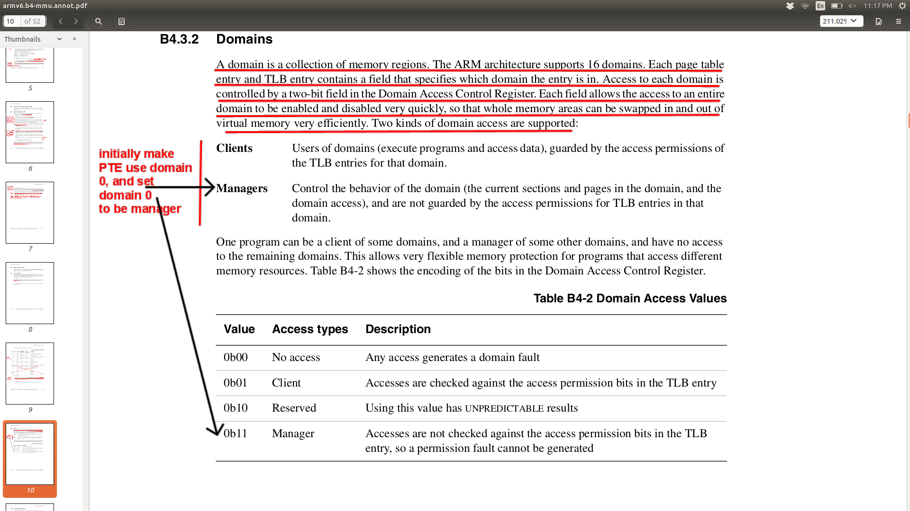

## Simple virtual memory.

Today you'll get a simple "hello world" version of virtual memory working.
This and the SD card file system are the biggest unknowns in our universe,
so we'll bang out quick versions of each, and then circle back around
and make your system more real.

#### The big picture

Many things in systems are simple, but the terminology and details makes
them seem scary.  Virtual memory is one of the best examples.  

Mechanically, all we want to do for virtual memory is to map integers
(virtual addresses) to integers (physical addresses).   Most of the
complication in VM boils down to the fact that there is no good way
to construct a general integer function.  If we want to map arbitrary
ints to ints, then we fundamentally have to use a brute force table.
(Quick proof: if the mapping is purely random, then its not compressible,
and we need to record everything.  Also known as a table.)

One question is what granularity the function works on.  In the extreme
we could map every byte in the virtual address space to any byte in
the physical address space.  This is flexible, but very high overhead.
For example, on the ARM, each page table entry (PTE) is 4 bytes, so
the page table would be 4x larger than the address space!  So we do
what we often do in systems to reduce the overhead of memory functions:
restrict flexibility and use quantization.  Here we break the address
space (physical and virtual) into fixed size ranges ("pages").  We allow
any virtual range to be mapped to any physical range, so we still need
a table for that: the page table now maps a virtual page number to a
physical page number.  However, all bytes within a virtual range are
mapped to the byte at the same offset in its associated physical range.
I.e., we use the identity function, which is fast and needs no table.
A 4096 page size will reduce our page table overhead by about 4096x and
because of spatial locality not reduce our flexibility that much.

To make this concrete:  
 - For today's lab, we will just map 1MB regions at a time.  ARM calls
 these "segments".
 - So the page table will map a virtual segment to a physical segment.
 - Our function's Domain: The r/pi has a 32-bit address space, so that
 is 4096 virtual segments.  Thus the function's domain is `[0..4096)`.
 - Our function's Range: Not including GPIO, The r/pi has 512MB of memory,
 so 512 physical segments.  Thus the function's range is `[0..512)`.
 - Thus, we are making a trivial integer function that will map
 `[0...4096) ==> [0..512)`.  (GPIO also adds some numbers to the
 range, but you get the idea.)  You built fancier functions in your
 intro programming class.  The only tricky thing here is that we need
 ours to be very fast.

This mapping (address translation) happens on every instruction, twice
if the instruction is a load or store.  Thus it must be fast.  So as you
expect we'll have one or more caches to keep translations (confusingly
called "translation lookaside buffers").  And, as you can figure out on
your own, if we change the function mapping, these caches have to be updated.
Keeping the contents of a table coherent coherent with a translation cache
is alot of work, so machines generally (always?) punt on this, and it is
up to the implementor to flush any needed cache entries when the mapping
changes. (This flush must either only finish when everything is flushed,
or the implementor must insert a barrier to wait).  

Finally, as a detail, we have to tell the hardware where to find the
translations for each different address space.  Typically there is a
register you store a pointer to the table (or tables) in.

The above is pretty much all we will do:
  1. For each virtual address we want to map to a physical address, insert
  the mapping into the table.
  2. Each time we change a mapping, invalidate any cache affected.
  3. When we start running a process, tell the hardware where to 
  find its translations.

#### Lab reading.

This is one of those labs where I probably should have given your
pre-lab reading, but we'll see if we can get through this without it.
The fundamental thing we are doing is not that complicated; though there
are a fair number of details.

The main thing you'll need for this lab: I've gone through about 100
pages of the ARM manual and annotated it.  No guarantee that these
are all the annotations necessary, but they definitely cover stuff you
should understand.  In the `./docs` directory for this lab:
   1. `armv6.b2-memory.annot.pdf`: section B2 of the ARM manual, 
   describing memory ordering requirements ---
   what you have to do when you update the page table, the page table
   registers, etc.

   2. `armv6.b3-coprocessor.annot.pdf`: section B3 of the ARM manual,
   describing the different co-processor options.

   3. `armv6.b4-mmu.annot.pdf`: section B4 of the ARM manual, describing
   the page table format(s), and how to setup/manage hardware state for
   page tables and the TLB.

#### Check-off

You need to show that:
  0. Part 0: you can do a test that checks that aliasing works and 
  that you can say what the cache organization is.
  1. Part 1: You can replace the code to setup the page table with 1MB sections.
  2. Part 2: You can replace the code to synchronize the hardware state and
  state what is going on and why.

Extensions:
   1. Setup two-level paging.
   2. Catch segmentation faults.

----------------------------------------------------------------------
## Part 0: make sure you can run the simple hello program (15 minute).

These are a quick set of tests (0, ~5, ~5, ~10 lines of code
respectively) to see that you have a crude picture of what is going on:

  0. Compile and run the code provided.  This is just a quick debug that
  your system is working fine.

  1. Write a test case that shows you get a fault when you reference
  unmapped memory.

  2. Write a test case that maps an address range to a different 
  one and test that its working.

  3. Write a simple routine (in assembly: should be one instruction and a
  return) to figure out what type of cache your pi has.  The instruction
  you need and its result are on B6-13 of the `armv6.annot.pdf` (see below).

----------------------------------------------------------------------
##### The cache configuration register

<table><tr><td>
  
</td></tr></table>

----------------------------------------------------------------------
----------------------------------------------------------------------
## Part 1: implement the code to setup page tables using 1MB sections (45 min)

You'll write the code to fill in the page table assuming the use of
1MB sections.

The document you'll need for this part is:
  * The annotated B4 of the ARM manual `docs/armv6.b4-mmu.annot.pdf`,
  which describes the page table format(s), and how to setup/manage
  hardware state for page tables and the TLB.

You'll do this in two steps:  Part 1.A and Part 1.B.

#### Part 1.A: define the page table entry structure.

First, you should define a `struct first_level_descriptor` in file `vm.h`
based on the PTE layout given on B4-27 (screenshot below):
  -  You'll defined fields for the section base address, `nG`, `S`,
  `APX`, `TEX`, `AP`, `IMP`, `Domain`, `XN`, `C`, `B`, and the tag.
  - You should look at the structure `struct control_reg1` given in
  `vm.h` to see how to use bitfields in C.
  - It is very easy to make mistakes. You will write a function
  `fld\_check()` modeled on `check_control_reg()` that uses the
  `check_bitfield` macro to verify that each field is at its correct
   bit offset, with its correct bit width.
  - Write a function `fld_print` to print all the fields in your structure.
  - HINT: the first field is at offset 0 and the `AssertNow` uses tricks
  to do a compile-time assert.

----------------------------------------------------------------------
##### The PTE for 1MB sections document:
<table><tr><td>
  
</td></tr></table>

----------------------------------------------------------------------
#### Part 1.B: implement `mmu_section`

Second, re-implement the `mmu_section` function we used in Part0.
The code you wrote then should behave the same.  You'll want to 
figure out what all the bits do.  (Hint: most will be set to 0s.)

Useful pages:
  - B4-9: `S`, `R`, `AXP`, `AP` (given below).
  - B4-12: `C`, `B`, `TEX` (given below).
  - B4-25: `nG`, `ASID`, 'XN`.
  - B4-28: bit[18] (the IMP bit) `IMP = 0` for 1MB sections.
  - B4-10: Domain permissions.
  - B4-29: translation of a 1MB section.

The following screenshots are taken from the B4 section, but we inline
them for easy reference:

----------------------------------------------------------------------
##### The definitions for `S`, `R`, `AXP`, `AP`:
<table><tr><td>
  
</td></tr></table>

----------------------------------------------------------------------
##### The definitions for `TEX`, `C`, `B`:
<table><tr><td>
  
</td></tr></table>

----------------------------------------------------------------------
##### Description of `XN`, `XP`, etc.

<table><tr><td>
  
</td></tr></table>

----------------------------------------------------------------------
## Part 2: Write hardware state.

Here you'll write assembly helper routines to (put them in `vm-asm.s`).
Mechanically, you will go through, one-at-a-time and replace every
function prefixed with "our_" to be our own code.  The code is setup
so that you can knock these off one at a time, making sure that things
work after each modification.

  1. Each page table entry above is tagged with one of the 16 ARM "domains".
  You have to specify the permissions of any used domains.  For 
  simplicity set all 16 domains to "all access" (`0b11`).  (See below)
  You should replace `our_write_domain_access_ctrl` with yours.

  2. The hardware has to be able to find the page table when there is
  a TLB miss.  Write the address of the page table to the page table
  register `ttbr0`.  Note the alignment restriction!  (See below)
  You will need to implement the code 
  `our_set_procid_ttbr0` for this, which also sets the ASID (next 
  bullet).

  3. The ARM allows each TLB entry to be tagged with an address space
  identifier so you don't have to flush when you switch address spaces.
  Set the current address space identifier (pick a number between 
  `1..63`).  

  4. Turn on the MMU.  The exact sequence is given below.  (See below)
  Your code should be `our_mmu_enable`.  You will have to also: flush
  the D/I cache, the TLB, the prefetch buffer, and the wait for everything.
  You'll have to look at Part 3 for the description.  Sorry!

I've inlined useful snapshots below:

----------------------------------------------------------------------
##### Protocol for turning on MMU.

<table><tr><td>
  
</td></tr></table>

----------------------------------------------------------------------
##### Bits to set in Domain
<table><tr><td>
  
</td></tr></table>

----------------------------------------------------------------------
##### Setting page table pointer.

<table><tr><td>
  
</td></tr></table>

----------------------------------------------------------------------
##### Bits to set to turn on MMU

<table><tr><td>
  
</td></tr></table>

----------------------------------------------------------------------
## Part 3: Flush stale state. (30 minutes)

The previous code (hopefully) works, but is actually incorrect.  We are
getting away with the fact that we are not running uncached, and we
haven't been switching between address spaces.

Weirdly, this is --- by far --- the hardest part to get right:
  1. If you get it wrong, your code may "work" fine. We are running with
  caches disabled, no branch prediction, and strongly-ordered memory
  accesses so many of the gotcha's can't come up.  However, later,
  they will.  And since at that point there will be more going on,
  it will be hard to figure out WTH is going wrong.

  2. Because flaws relate to memory --- what values are returned from
  a read, or what values are written --- they give "impossible" bugs
  that you won't even be checking for, so won't see.  (E.g., a write to a
  location disappears despite you staring right at the store that does it,
  a branch is followed the wrong way despite its condition being true).
  They are the ultimate memory corruption, but much fancier.

So for this part, like the `uart` lab, you're going to have to rely very
strongly on the documents from ARM and find the exact prose that states
the exact sequence of (oft non-intuitive) actions you have to do.

Mostly you'll find these in:

   * Section B2 of the ARM manual (`docs/armv6.b2-memory.annot.pdf`)
   describing memory ordering requirements --- what you have to do when
   you update the page table, the page table registers, etc.

Useful pages:
  - B6-22: all the different ways to flush caches, memory barriers (various
    snapshots below).
  - B2-23: how to flush after changing a PTE.
  - B2-24: must flush after a CP15.
  - B2-25: how to change the address space identifier (ASID). 

----------------------------------------------------------------------
##### When do you need to flush 

<table><tr><td>
  
</td></tr></table>

----------------------------------------------------------------------
##### Sync ASID

<table><tr><td>
  
</td></tr></table>

----------------------------------------------------------------------
##### When to flush BTB

<table><tr><td>
  
</td></tr></table>

----------------------------------------------------------------------
##### How to invalidate after a PTE change

<table><tr><td>
  
</td></tr></table>

----------------------------------------------------------------------
##### Invalidate TLB instruction

<table><tr><td>
  
</td></tr></table>

----------------------------------------------------------------------
##### DSB, DMB instruction

<table><tr><td>
  
</td></tr></table>

----------------------------------------------------------------------
##### Flush prefetch buffer and others

<table><tr><td>
  
</td></tr></table>

-----------------------------------------------------------------------
### Further reading

As an alternative to our lab writeup:
 * [Concise, concrete pi MMU](https://github.com/naums/raspberrypi/blob/master/mmu/README.md)

Useful code (use to double-check understanding):
 - [Linux TLB code for V6](https://elixir.bootlin.com/linux/latest/source/arch/arm/mm/tlb-v6.S).
 - [Linux cache code for V6](https://elixir.bootlin.com/linux/latest/source/arch/arm/mm/cache-v6.S).
 - [MMU code for vmwos](https://github.com/deater/vmwos/blob/master/kernel/memory/arm1176-mmu.c)
 - [PiOS source](https://www.stefannaumann.de/git/snaums/PiOS/src/branch/master/source)

To re-affirm your grasp of virtual memory, the slides from 
[CS140 lecture notes](http://www.scs.stanford.edu/19wi-cs140/notes/) give
 a big picture overview:
  1. [Virtual memory hardware](http://www.scs.stanford.edu/19wi-cs140/notes/vm_hardware-print.pdf).
  2. [Virtual memory OS](http://www.scs.stanford.edu/19wi-cs140/notes/vm_os-print.pdf)

And for more detail, the book [Operating systems in three easy pieces](http://pages.cs.wisc.edu/~remzi/OSTEP/) provides chapters online.  You want to look at:
  1. [Address spaces](http://pages.cs.wisc.edu/~remzi/OSTEP/vm-intro.pdf).
  2. [Address translation](http://pages.cs.wisc.edu/~remzi/OSTEP/vm-mechanism.pdf).
  3. [Translation lookaside buffers](http://pages.cs.wisc.edu/~remzi/OSTEP/vm-tlbs.pdf).
  4. [Complete VM systems](http://pages.cs.wisc.edu/~remzi/OSTEP/vm-complete.pdf).

DSB as a superset of DMB:
https://community.arm.com/processors/f/discussions/3287/questions-regarding-dmb-dsb-and-isb

